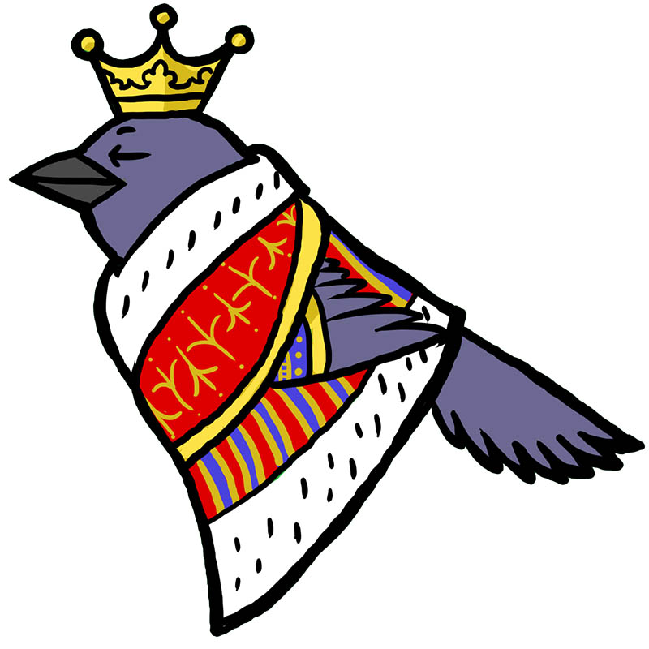

*This project is not ready for use at this time.*

# Regal Bird


Regal Bird is a ruby gem for automating a process as a series of steps, similar to an
ETL service.  It is intended for transactional operations on individual units of work.

## When to use Regal Bird

* You need to send units of data through a process.
* Your process can be represented as a single path through a finite state machine.

## When not to use Regal Bird

* You need to operate on batches of data. 
* Your process contains operations that are dependent on two or more operations
  that should be run concurrently, and these cannot just be run in sequence.
* You need to control the order in which the data units are processed (e.g. for a bidding
  system).

# Installation

Install like you would any other gem.  Regal Bird is intended to be a dependency of a 
domain-specific project that defines the process it will automate, so we recommend simply
including it as a bundled dependency.  As with all gems, installing into the system-wide 
gems is not recommended.

# Configuration

Regal Bird will look for a configuration file at 
`<project_root>/config/regal_bird.yml`.  The following fields are expected:
* queue_adapter: Regal Bird uses ActiveJob, so any queue adapter recognized by 
  ActiveJob will suffice.  
* scheduler: In order for Regal Bird to run automatically, it requires a scheduling
  backend.  For example, if your queue_adapter is `:resque`, you could install resque-scheduler
  and set this to `:resque_scheduler`.  The default is `:disabled`, in which case 
  Regal Bird will do nothing unless invoked, e.g. by a cron task.
* plan_dir: The directory of your plan files.  The default is `<project_root>/plans`
* db: A stanza that describes how to connect to the database. Uses the same format and 
  options as ActiveRecord and Sequel.

# Usage

For Regal Bird to be of any use at all, you'll need to both define a plan (in a yaml file)
and the actions--as ruby classes--to be taken as part of that plan.

## Defining a Plan

Plans are represented by yaml files, and consist of three parts.

### Part 1: Declaring Sources

The first part of a plan will define one or more sources.  Sources discover units of work
on which the rest of the plan will be carried out.  Most plans will likely only have one
source, but any number of sources can be defined.  Sources should define the same type of
units of work; if you have sources that define different units of work, then you likely want 
to separate them into their own plans.  

Your plan file should look something like this:

```yaml
source:
  - MyDomain::MyFirstSource
  - MyDomain::MyOtherSource
```

### Part 2: Declaring Actions

This makes up the bulk of any plan.  It is simply any number of state:action pairs, where the 
state is a string or symbol and the action is a class.  Each unit of work will have the action 
run against it that corresponds to the unit's current state.  State:action pairs are a 1-to-1 
mapping; do not define a state more than once, and do not declare an array of actions.

Your plan file should look something like this:

```yaml
ready: MyDomain::FooAction
set: MyDomain::BarAction
go: MyDomain::BazAction
```

### Part 3: Declaring Terminal States

It's likely that you do not want units that have completed or failed to remain in
Regal Bird's docket.  A special action is provided that will remove a unit, 
`RegalBird::Action::Clean`.  Please note that if you wish to do something useful
when a unit is in a failed state, it may be useful to represent that.  Your plan might
look like this:

```yaml
cancelled: RegalBird::Action::Clean
finished: RegalBird::Action::Clean
```

### Putting it all together

Here's a simple plan (that I've intentionally overcomplicated) that emails a 
newsletter and sends a Twitter message.

```yaml
source:
  - CoolBlog::Newsletter::GetUsers
ready:        CoolBlog::Newsletter::SendEmail
no_email:     RegalBird::Action::Clean
email_sent:   CoolBlog::Newsletter::GetTwitterHandle
no_twitter:   RegalBird::Action::Clean
handle_found: CoolBlog::Newsletter::SendTwitter
done:         RegalBird::Action::Clean
```

## Defining Sources and Actions

### Defining Sources

Short version: Subclass RegalBird::Source, define `#execute` and `#id`.

Sources obtain sets of data, generally from an external service.  A source must define a single
`#execute` method that returns an array of RegalBird::Event instances.  Like this:

```ruby
class GetUsers < RegalBird::Source
  def execute
    start_time = Time.now.utc
    users = User.active
    users.map do |user|
      RegalBird::Event.new(state: :ready, action: "GetUsers",
        start_time: start_time, end_time: Time.now.utc,
        data: {id: user.name, user: user.email}
      )
    end
  end
end
```

Obviously, this is a bit much, and the above doesn't even handle exceptions.  Regal Bird provides
some convenience methods for you so that the above can be written as below.  This will handle
exceptions automatically (by trying again).

```ruby
class GetUsers < RegalBird::Source
  def execute
    wrap_execution do
      Users.active.map do |user|
        success(:ready, {email: user.email})
      end
    end
  end
end
```

Notice that the parameters to `#success` does not contain the `id: user.name` from the 
verbose example.  This is because `#success` will make a call to `#id`, passing on its
second parameter (`{user: user.email}`).  By default, `#id` simply returns a 
UUID.  You are *highly encouraged* to override `#id`, as the default behavior will result
in duplicate entries per unit of work for most use cases.

### Defining Actions

Defining actions is very similar to defining sources.  Unlike sources, actions can draw upon
information previously recorded about that unit of work.  This information is represented
as a RegalBird::EventLog, which is an append-only data structure.  The most common way to
get information from the log is with `#get(key)`.  So to retrieve our user's email from
before, we'd do `get(:email)`.  `#get` always retrieves the most recent value for the key.

Please note that only JSON-serializable data can be stored or retrieved from the event log.
The event log will handle serialization and deserialization for you.

```ruby
class GetTwitterHandle < RegalBird::Action
  def execute
    start_time = Time.now.utc
      handle = TwitterService.handle(event_log.get(:email))
      if handle != nil
        RegalBird::Event.new(state: :handle_found, action: self.class.to_s,
          start_time: start_time, end_time: Time.now.utc,
          data: {handle: handle}
        )
      else
        RegalBird::Event.new(state: :no_twitter, action: self.class.to_s,
          start_time: start_time, end_time: Time.now.utc,
          data: {}
        )
      end
  end
end
```

Again, you are *highly encouraged* to use `#wrap_execution` and the other convenience methods.
They clean up the above code, and handle any exceptions raised.  Note that the default
behavior for handling exceptions is to:
 1. Remain at the current state
 2. Log the exception to a file log.
 3. Store an Event with an id that can be used to find the logged exception.
 
The above can be rewritten as the following:

```ruby
class GetTwitterHandle < RegalBird::Action
   def execute
     wrap_execution do
       if handle != nil
         success(:handle_found, {handle: handle})
       else
         success(:no_twitter, {})
       end
     end
   end
 end
```

This now features the default exception handling behavior.  In addition, there are
two other convenience methods that can be used within `#wrap_execution`:
* `#failure(message or exception)` will perform the failure behavior described above.
* `#noop` for when the action succeeded, but the state did not change.  This is useful
  for checking if an external service has completed an operation.

## More Information

This readme covers most of the functionality, but not all of it.  For that, please
consult the [rubydoc](http://www.rubydoc.info/github/mlibrary/regal_bird/master).

# Contributing

You will need to assign a license to your contribution that is compatible
with the Revised BSD License of the project (see LICENSE.txt).  You are not
required to assign the copyright to the Regents of the University of Michigan.
If you are adding a file, include a copyright notice in the header.


# License

```
Copyright (c) 2017 The Regents of the University of Michigan.
All Rights Reserved.
Licensed according to the terms of the Revised BSD License.
See LICENSE.txt for details.
```